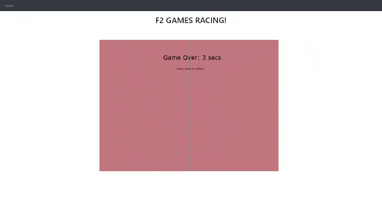

# F2 Racing
This is a browser game where the player controls a car and must dodge oncoming cars, made with Javascript and Jquery in the HTML canvas. I implemented a collision detection algorithm to trigger the game over function when the user hits a car. A cool feature is the animated background used to simulate moving on a road. I used a for loop and drawing functions for that.

